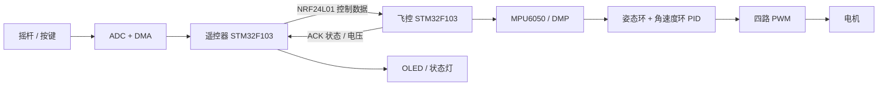

## 项目简介

Drone Remote STM32 是一套由两个独立固件组成的无人机控制项目：

- `Drone`：运行在飞行器上的飞控固件，负责姿态解算、PID 控制、电机输出、无线接收和状态回传。
- `Remote`：运行在手持遥控器上的固件，负责摇杆采样、按键与 OLED 交互、无线发包及配对。

两端均基于 `STM32F103C8`，通过 `NRF24L01` 建立双向无线链路。飞控端使用 `MPU6050 DMP` 获取姿态信息，并通过双环 PID 完成四轴姿态控制。



## 功能特性

### 飞控端

- MPU6050 DMP 姿态解算
- 约 `200 Hz` 飞控控制周期
- 姿态角外环 + 角速度内环 PID
- 四路电机 PWM 输出与混控
- NRF24L01 遥控接收、自动应答与配对
- 遥控信号丢失、姿态异常和低电压保护
- 飞机解锁与上锁状态管理
- PID 参数 Flash 持久化
- USART2 匿名上位机遥测与 PID 调参
- 支持空心杯四轴、固定翼和无刷四轴的编译期开关，当前配置为无刷四轴

### 遥控器端

- 四路摇杆 ADC 扫描与 DMA 采样
- `50 Hz` 定时采样和无线发包
- NRF24L01 自动重发及 ACK 载荷接收
- 基于芯片唯一 ID 的配对信息生成
- OLED 配对/连接状态显示
- 左右功能按键与 RGB 状态灯
- USART1 调试输出

## 硬件组成

| 模块        | 飞控端                       | 遥控器端                     |
| ----------- | ---------------------------- | ---------------------------- |
| 主控        | STM32F103C8                  | STM32F103C8                  |
| 无线通信    | NRF24L01，接收控制并返回 ACK | NRF24L01，发送控制并接收 ACK |
| 传感器/输入 | MPU6050、机载电压 ADC        | 四路摇杆 ADC、功能按键       |
| 输出/显示   | 四路 PWM、RGB 状态灯         | OLED、RGB 状态灯             |
| 调试接口    | USART2，115200 baud          | USART1，115200 baud          |

> 不同硬件版本的引脚定义可能不同。焊接或制作 PCB 前，请以 `Drone/OBJ` 和 `Remote/driver` 中的头文件及驱动源码为准。

## 快速开始

### 1. 准备开发环境

- Keil MDK-ARM / µVision 5
- ARM Compiler 5（当前工程配置使用 ARMCC 5）
- Keil STM32F1 Device Family Pack
- ST-Link 或其他兼容 SWD 下载器

### 2. 获取代码

```bash
git clone https://github.com/AugensternCode/Drone_Remote_stm32.git
cd Drone_Remote_stm32
```

### 3. 编译飞控固件

使用 Keil 打开：

```text
Drone/USER/UAV.uvprojx
```

选择目标后执行 `Rebuild`。默认输出目录为 `Drone/USER/Objects/`。

机型配置位于 `Drone/USER/precompile.h`。三个机型宏应当只启用一个：

```c
#define FOUR_AXIS_UAV              0
#define FIXED_WING_AIRCRAFT        0
#define BRUSHLESS_FOUR_AXIS_UAV    1
```

### 4. 编译遥控器固件

使用 Keil 打开：

```text
Remote/user/remote.uvprojx
```

执行 `Rebuild` 后，构建结果生成在 `Remote/out_file/`，工程已启用 Hex 文件输出。

### 5. 安全联调

1. 拆下全部螺旋桨。
2. 分别刷写遥控器和飞控固件。
3. 检查 NRF24L01、MPU6050 和状态灯的初始化结果。
4. 完成遥控器与飞控配对。
5. 在串口或上位机中确认姿态、摇杆和电压数据正确。
6. 检查四路电机顺序、旋向和混控方向后，再进行低功率测试。

## 工作流程

### 飞控端

飞控初始化完成后，核心控制任务运行在 `TIM3_IRQHandler()` 中，每约 `5 ms` 执行一次：

```text
接收与解析遥控数据
        ↓
读取 MPU6050 姿态与角速度
        ↓
生成目标姿态
        ↓
姿态角外环 PID
        ↓
角速度内环 PID
        ↓
四轴混控与 PWM 输出
        ↓
保护、状态灯与低频遥测
```

### 遥控器端

遥控器由 `TIM4` 每 `20 ms` 触发 ADC 扫描，DMA 完成中断负责换算、组包和发送：

```text
TIM4 触发 ADC → DMA 获取四路摇杆 → 数据换算与组包
      → NRF24L01 发射 → 读取 ACK → 更新 OLED 与状态灯
```

项目内还提供了可编辑的 Draw.io 流程图：

- [飞控主流程](./Drone主流程.drawio)
- [遥控器主流程](./Remote主流程.drawio)

## 项目结构

```text
Drone_Remote_stm32/
├── Drone/                  # 飞控端固件
│   ├── USER/               # 程序入口、Keil 工程与配置
│   ├── OBJ/                # 飞控业务模块（不是编译输出目录）
│   ├── CMSIS/              # Cortex-M3 / STM32 启动与系统文件
│   └── LIB/                # STM32F10x 标准外设库
├── Remote/                 # 遥控器端固件
│   ├── user/               # 程序入口与 Keil 工程
│   ├── driver/             # ADC、OLED、NRF24L01 等驱动与业务逻辑
│   ├── core/               # Cortex-M3 启动与内核文件
│   └── st_lib/             # STM32F10x 标准外设库
├── Drone主流程.drawio      # 飞控流程图
└── Remote主流程.drawio     # 遥控器流程图
```

进一步了解实现细节：

- [飞控端详细说明](./Drone/README.md)
- [遥控器端详细说明](./Remote/README.md)

## 推荐阅读顺序

### 飞控端

1. `Drone/USER/main.c`
2. `Drone/OBJ/timer.c`
3. `Drone/OBJ/parse_packet.c`
4. `Drone/OBJ/controller.c`
5. `Drone/OBJ/pid.c`
6. `Drone/OBJ/imu.c`

### 遥控器端

1. `Remote/user/main.c`
2. `Remote/driver/timing_trigger.c`
3. `Remote/driver/adc.c`
4. `Remote/driver/sendpacket.c`
5. `Remote/driver/nrf24l01.c`
6. `Remote/driver/pair_freq.c`

## 路线图

- [ ] 整理并发布两端硬件原理图与接线表
- [ ] 增加可复现的固件 Release 构建
- [ ] 补充遥控通信协议文档
- [ ] 增加传感器校准操作说明
- [ ] 完善定高、定点等预留控制功能
- [ ] 增加自动化静态检查或持续集成

欢迎通过 [Issues](https://github.com/AugensternCode/Drone_Remote_stm32/issues) 提交问题或功能建议。

## 贡献指南

任何形式的贡献都很欢迎，包括修复缺陷、补充文档、整理硬件资料以及改进控制算法。

1. Fork 本仓库。
2. 从 `main` 创建功能分支。
3. 完成修改并验证飞控端或遥控器端能够正常编译。
4. 避免提交 `Objects/`、`Listings/`、`out_file/` 等构建产物。
5. 提交 Pull Request，并说明硬件环境、测试方式和可能影响。

涉及 PID、混控、电机输出或保护逻辑的修改，请在 PR 中特别描述实机验证条件，并始终先进行无桨测试。

## 贡献者

感谢所有参与代码、文档、测试和反馈的贡献者。

<a href="https://github.com/AugensternCode/Drone_Remote_stm32/graphs/contributors">
  
</a>

## Stars 趋势

如果这个项目对你有帮助，欢迎点亮一个 Star，这会帮助更多嵌入式与无人机爱好者发现它。

[](https://star-history.com/#AugensternCode/Drone_Remote_stm32&Date)

---

<div align="center">
